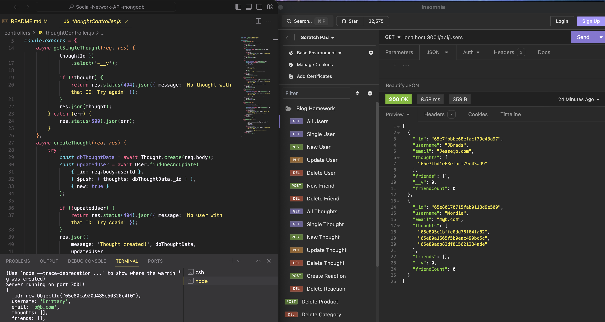

# Social-Network-API-MongoDB [](https://opensource.org/licenses/MIT)

Back end API development using MongoDB for a Social Networking App. 


## Description:
This setup enables the backend routes for an social media website to create, read, update, and delete Users, and Posts by those users. For this project were calling those posts "Thoughts". Users can also add eachother as friends, and can reply to eachothers thoughts with "Reactions". We also have virtuals set up that will count our friends, and the responses to our thoughts. 


This is a exercise in using MongoDB with Mongoose. This was practice using a NoSQL database.    

## Table of Contents:
  - [Installation](#installation)
  - [Usage](#usage)
  - [Demonstration](#demonstration)
  - [License](#license)


## Installation:
This application requires using express, mongoose, and MongoDB, use "npm i" to install the required dependencies. You can run the application by using the command "npm run start" 

## Usage:
Invoke the express server by using the command "npm run start" . It will then allow you to send Create, Read, Update, and Delete requests to the available routes. 

Use ```/api/users ``` or ```/api/thoughts``` to get all data from each of the two models. See the routes folder for more details reagarding all available CRUD routes. 



## Demonstration:
[Here is a video demonstration of my application](https://drive.google.com/file/d/1KtnNVYf5D6DLa3Q9fQ1lwSWEX7tXCzL1/view)

## License:
-[MIT](https://opensource.org/license/mit/) 

### Enjoy!


